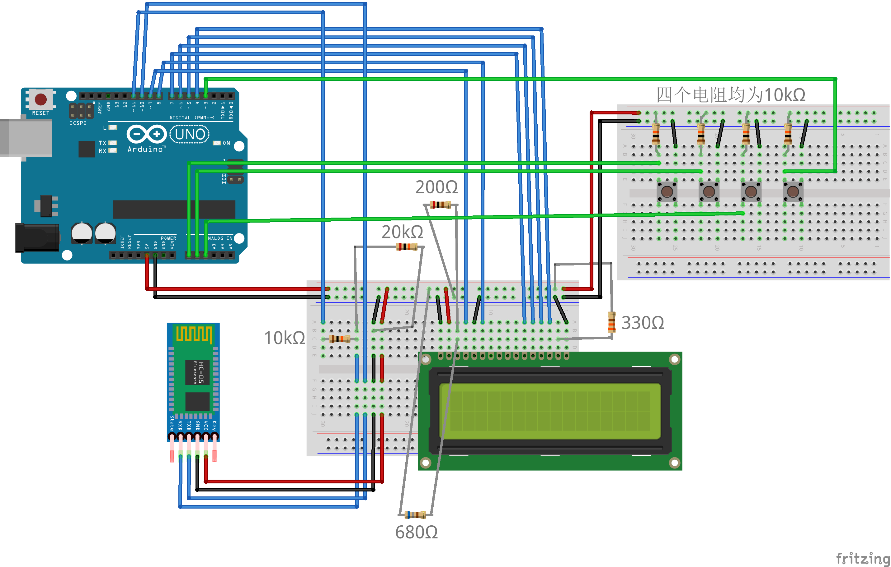

# KFBot

此仓库代码配合蓝牙HID鼠标模块，应用于Kirara Fantasia (きららファンタジア、きらファン) 手游的自动挂机。

## 所需硬件参考

1. Arduino Uno；
2. BTKM-05（DEMO板，内含的蓝牙鼠标模块星号为XM-04-HID-M）；
3. 10kΩ电阻2个、20kΩ电阻1个、220Ω电阻一个；
4. 导线若干；
5. LCD1602液晶屏幕、电位器2个。

## 开发用测试机型

iPhone 6s (iOS 13.4)

## 模块连接方法

蓝牙HID模块：见我制作的[视频](https://www.bilibili.com/video/BV1de411s7tc)；

LCD1602模块：[http://m.elecfans.com/article/687697.html](http://m.elecfans.com/article/687697.html)

### 连接参考：

1. 图中的蓝牙模块实际为普通的蓝牙模块，没有HID的功能，但与HID蓝牙模块外观完全相同。由于在fritzing中找不到HID模块，用此普通模块代替；
2. LCD1602模块的引脚3和引脚15分别为控制显示亮度和背光的引脚，可以分别接电位器以方便随时调节。此处接的电阻使显示亮度不太亮，且背光处于最合适的状态。

## 代码使用方法

### 基本使用方法

1. 根据蓝牙模块连接情况，修改`GeneralMouse.h`文件中的第一个私有属性bTserial的代表RX和TX的引脚号；
2. 根据LCD模块连接情况，修改`CtrlLCD.h`文件中的私有属性lcd的引脚号；
3. 根据设备情况，调整硬编码在`KFMouse.cpp`文件中的数值以使光标能移动到正确的位置（见[下一小节](#自行增加类方法--调整光标移动位置)）；
4. 根据自身情况，在`KFWorkflow.cpp`文件内建立不同的鼠标工作流；
5. 编译上传。

### 自行增加类方法 / 调整光标移动位置

1. 将主程序文件`KFBot.ino`中`loop()`函数中的myLCD执行的方法换成`debugUsingKeyboard()`；
2. 编译上传，此时可以使用键盘通过串口监视器发送数据（基本为wasd四个按键）；
3. 自行修改方法`debugUsingKeyboard()`为方便调试。